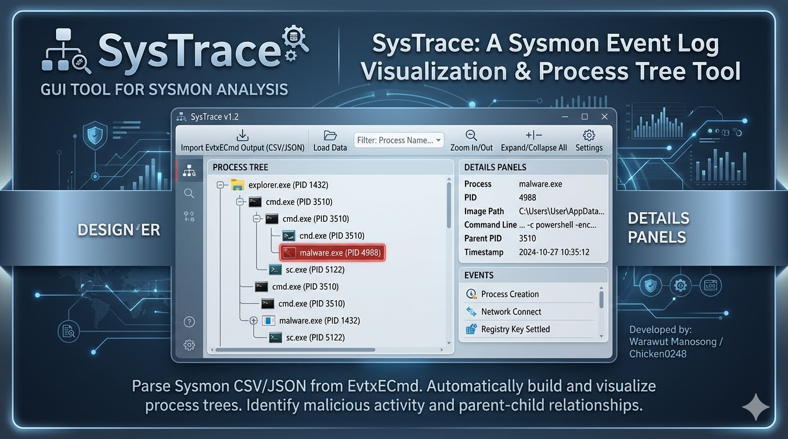
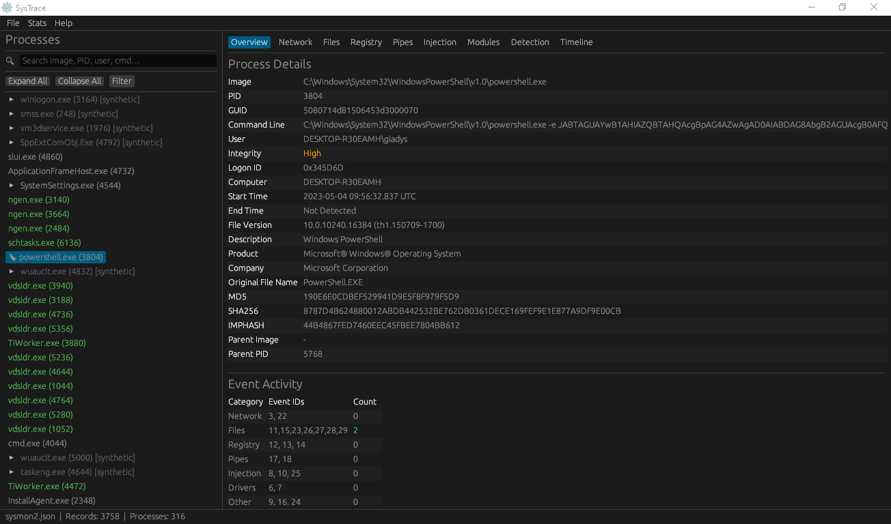
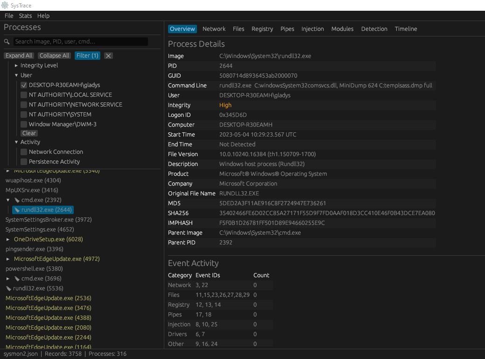
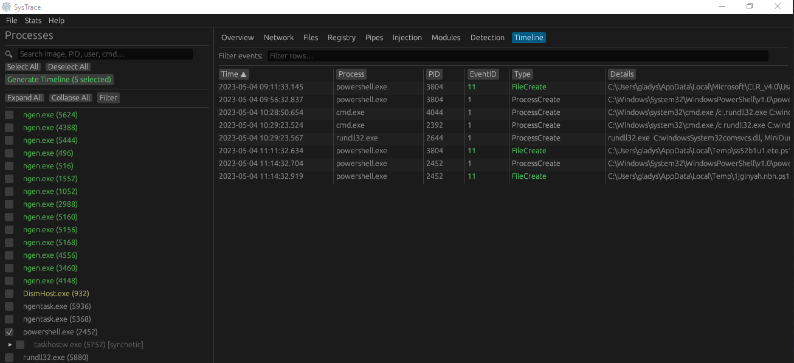
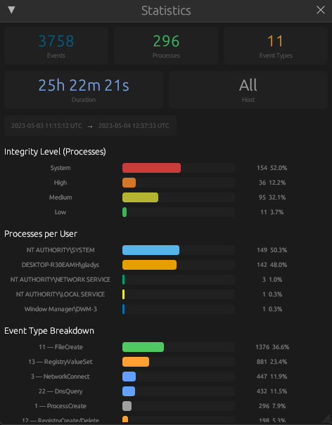
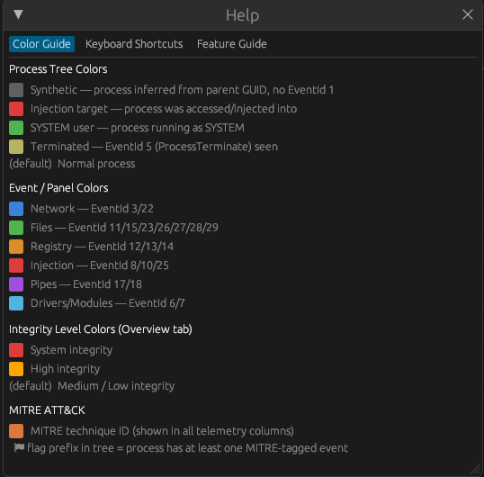

# SysTrace



A fast, native GUI forensic analysis tool for **Sysmon** logs. Parses EVTXECmd NDJSON exports and presents them as an interactive process tree with process-centric telemetry browsing — built for DFIR investigators.


---

## Features

- **Interactive process tree** — full parent/child hierarchy from Sysmon EventId 1, with color coding for injection targets, SYSTEM processes, terminated processes, and synthetic placeholders
- **9 telemetry tabs** per process — Overview, Network, Files, Registry, Pipes, Injection, Modules, Detection, Timeline
- **Cross-process timeline** — select multiple processes, generate a unified time-sorted event table
- **Forensic filters** — Integrity Level, User, Network Activity, Persistence Activity, and MITRE ATT&CK technique filters; all AND-logic with badge count
- **Detection tab** — surfaces EventIds 2, 4, 9, 16, 19–21, 24 that are invisible elsewhere, color-coded by category
- **MITRE ATT&CK** — technique IDs parsed from RuleName, shown as columns in every table and as a tree filter
- **Stats popup** — metric cards and bar charts for event types, integrity levels, users, and hosts
- **Process bookmarks** — attach investigation notes to any process node
- **Multi-host support** — host selector when the file contains events from multiple machines
- **Export** — CSV, JSON, and Graphviz DOT formats
- **Drag & drop** file loading with live progress bar

---

## Screenshots

### Process Tree & Overview



Browse the full process hierarchy on the left. Select any process to see its metadata, file hashes, command line, parent info, and a per-category event activity summary on the right.

### Filter Panel



Click **Filter** in the toolbar to expand the filter panel. Filter by Integrity Level, User, Activity type, and MITRE techniques simultaneously. The badge (e.g. `Filter (1)`) shows how many categories are active. Click **✕** to clear all filters at once.

### Cross-Process Timeline



Select multiple processes using checkboxes, then click **Generate Timeline** to produce a unified, time-sorted event table across all selected processes. Filter rows by keyword in the search bar above the table.

### Statistics



Open **Stats** from the menu bar for a summary of the loaded dataset — total events, processes, event types, and duration — plus bar charts breaking down activity by integrity level, user, and event type.

### Help & Color Guide



The **Help** menu (or press `F1`) opens a reference window with three tabs: Color Guide (process tree and panel color meanings), Keyboard Shortcuts, and Feature Guide.

---

## Getting Started

### Prerequisites

- **Sysmon** installed and running on the target Windows host
- **[EVTXECmd](https://github.com/EricZimmerman/evtx)** (Eric Zimmerman's tool) to export the `.evtx` log to NDJSON

### Export Sysmon logs with EVTXECmd

```powershell
EVTXECmd.exe -f "C:\Windows\System32\winevt\Logs\Microsoft-Windows-Sysmon%4Operational.evtx" --json C:\output --jsonf sysmon.json
```

This produces a `.json` file where each line is a self-contained Sysmon event record.

### Open in SysTrace

```
systrace-gui sysmon.json
```

Or drag and drop the file onto the window.

---

## Download

Pre-built binaries for every platform are on the [Releases](../../releases) page:

| Platform | File |
|---|---|
| Windows x86_64 | `systrace-windows-x86_64.exe` |
| Linux x86_64 | `systrace-linux-x86_64` |
| macOS Intel | `systrace-macos-x86_64` |
| macOS Apple Silicon | `systrace-macos-aarch64` |

> **Linux note:** The binary is built on Ubuntu 22.04 (glibc 2.35). It requires X11 or Wayland and OpenGL at runtime. On headless servers, set up a virtual display with Xvfb.

---

## Building from Source

### Requirements

- Rust stable toolchain (`rustup install stable`)
- On Linux: X11/Wayland/OpenGL development headers

```bash
# Linux — install system dependencies first
sudo apt-get install -y \
  pkg-config libx11-dev libxcb-render0-dev libxcb-shape0-dev \
  libxcb-xfixes0-dev libxkbcommon-dev libwayland-dev libgl1-mesa-dev

# All platforms
cargo build --release -p systrace-gui

# Run
cargo run -p systrace-gui -- path/to/sysmon.json
```

---

## Interface Overview

```
┌─ Menu ──────────────────────────────────────────────────────┐
├─ Sidebar ─────────────┬─ Telemetry ─────────────────────────┤
│ 🔍 Search             │ [Overview][Network][Files][Registry] │
│ [Expand][Collapse]    │ [Pipes][Injection][Modules]          │
│ [Filter (2)] [✕]      │ [Detection][Timeline]                │
│  ├── Filter panel     │                                      │
│  │   Integrity Level  │  Selected process telemetry          │
│  │   User             │  (virtual-scrolled table)            │
│  │   Activity         │                                      │
│  │   MITRE            │                                      │
│                       │                                      │
│ ▶ services.exe (720)  │                                      │
│   ▶ svchost.exe (904) │                                      │
│     ▶ powershell.exe  │                                      │
│       cmd.exe         │                                      │
├───────────────────────┴──────────────────────────────────────┤
│ Status bar: filename · records · processes · load progress   │
└──────────────────────────────────────────────────────────────┘
```

### Process Tree colors

| Color | Meaning |
|---|---|
| Dark gray | Synthetic — parent inferred, no ProcessCreate event seen |
| Red | Injection target — received CreateRemoteThread / ProcessAccess |
| Green | SYSTEM user |
| Gold | Terminated — ProcessTerminate (EventId 5) seen |
| Default | Normal process |

### Filter panel

Click **Filter** in the toolbar to expand. All categories are AND-logic — a process must satisfy every active category to appear in the tree.

- **Integrity Level** — System / High / Medium / Low
- **User** — checkbox per unique user from real ProcessCreate events
- **Activity** — Network Connection (has EventId 3/22) · Persistence Activity (touches Run keys, Services, Scheduled Tasks, WMI, Winlogon, or is `schtasks.exe` / `at.exe`)
- **MITRE Techniques** — checkbox per technique ID found in the loaded file

The badge on the button (e.g. `Filter (2)`) shows how many categories are active. Click **✕** to clear all.

---

## Telemetry Tabs

| Tab | Event IDs | Key columns |
|---|---|---|
| Overview | 1, 5 | Metadata, hashes, MITRE summary, notes |
| Network | 3, 22 | Time, Direction, Protocol, Source, Destination, Hostname |
| Files | 11, 15, 23, 26–29 | Time, Action, Target Filename, Hashes |
| Registry | 12, 13, 14 | Time, Action, Target Object, Details |
| Pipes | 17, 18 | Time, Action, Pipe Name |
| Injection | 8, 10, 25 | Time, Type, Role, Source, Target, Details |
| Modules | 6, 7 | Time, Image Loaded, Signature, Status |
| Detection | 2, 4, 9, 16, 19–21, 24 | Time, EventID, Type, Details (color-coded) |
| Timeline | all | Cross-process unified timeline |

Right-click any table row to copy individual fields or the full row as TSV.

---

## Keyboard Shortcuts

| Key | Action |
|---|---|
| `Ctrl+O` | Open file dialog |
| `Ctrl+F` | Focus process search box |
| `↑` / `↓` | Navigate process tree |
| `Ctrl+Tab` | Next telemetry tab |
| `Ctrl+Shift+Tab` | Previous telemetry tab |
| Drag & Drop | Drop `.json` / `.ndjson` onto window to open |

---

## Architecture

SysTrace is a Cargo workspace with two crates:

```
crates/
├── systrace-core/   parsing, process tree, event store (library)
└── systrace-gui/    egui/eframe GUI application (binary)
```

**Key decisions:**
- **egui** (immediate mode) — virtual scrolling handles 1M+ events without DOM overhead
- **Two-phase parsing** — top-level EVTXECmd fields first, then the inner `Payload` JSON string for `EventData.Data[]`
- **Indexed EventStore** — events indexed by ProcessGuid, EventId, and target process at ingestion; no on-demand linear scans
- **Background ingestion** — file parsing runs on a background thread; batches of 500 events sent over a crossbeam channel to keep the UI responsive
- **ProcessGuid as primary key** — PIDs are reused; GUIDs are stored as `[u8; 16]` with FxHashMap for fast lookup

> Full architecture document: [`.claude/architecture.md`](.claude/architecture.md)

---

## License

MIT
